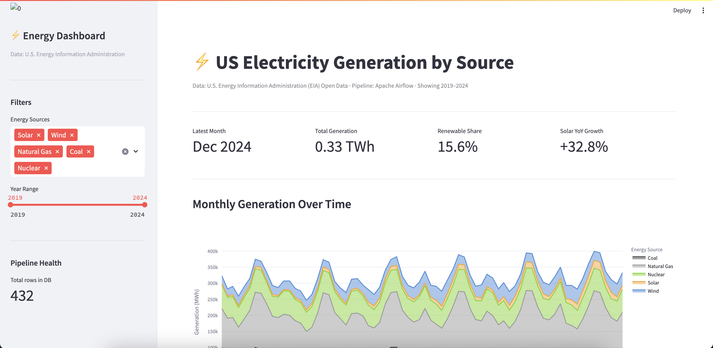
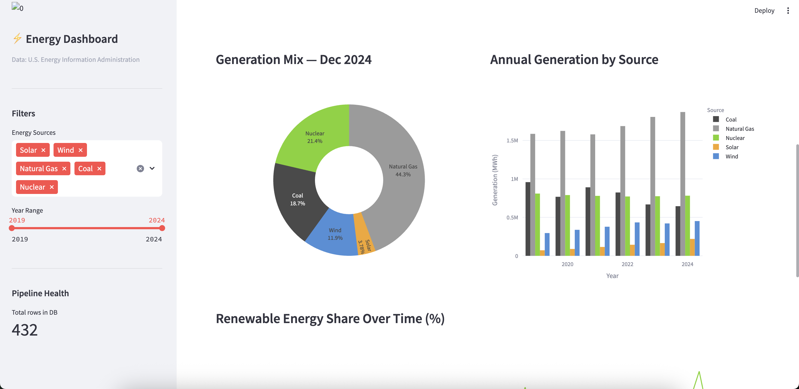
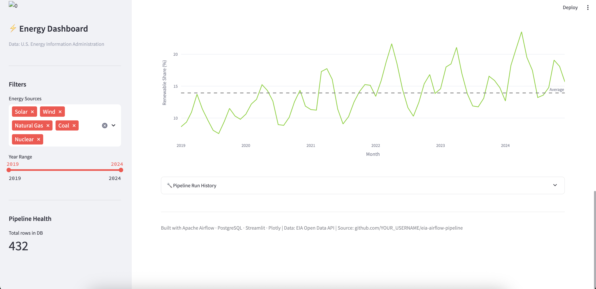

# US Energy Generation Pipeline

I built this as a portfolio project to learn data engineering. It pulls real electricity generation data from the US government's EIA API, loads it into PostgreSQL, and visualizes it in a Streamlit dashboard — all orchestrated automatically by Apache Airflow.

The data shows how the US energy mix has shifted from 2019 to 2024. Solar is up 32.8% year-over-year. Natural gas still dominates at 44% of generation. Renewables hit 15.6% share in late 2024.

---

## Dashboard







---

## How the Pipeline Works

Every week, Airflow automatically runs 4 tasks in sequence:

1. **create_tables** — makes sure the PostgreSQL schema exists
2. **extract_and_load** — calls the EIA API, cleans the data with pandas, and bulk-upserts it into Postgres
3. **validate_load** — checks that rows actually made it in, fails loudly if something went wrong
4. **log_run** — records the run metadata so you can track pipeline health over time


The pipeline is idempotent — you can run it multiple times and it won't create duplicate rows. That's handled with `INSERT ... ON CONFLICT DO NOTHING` in the database layer.

---

## Stack

- **Orchestration:** Apache Airflow 2.8
- **Language:** Python 3.11
- **Database:** PostgreSQL 15
- **Data processing:** pandas
- **Dashboard:** Streamlit + Plotly
- **Data source:** [EIA Open Data API](https://www.eia.gov/opendata/) (free)

---

## Project Structure

```
├── dags/
│   └── eia_energy_pipeline.py   # The Airflow DAG (4 tasks, weekly schedule)
├── utils/
│   ├── api_helpers.py           # Calls the EIA API and cleans the response
│   └── db_helpers.py            # PostgreSQL connection, upserts, queries
├── dashboard/
│   └── app.py                   # Streamlit dashboard
├── sql/
│   └── schema.sql               # Table definitions + useful queries
├── tests/
│   └── test_pipeline.py         # Unit tests
└── .env.example                 # Environment variable template
```

---

## Running It Locally

**Prerequisites:** Python 3.11, PostgreSQL 15, a free [EIA API key](https://www.eia.gov/opendata/register.php)

```bash
# Clone and set up
git clone https://github.com/PrashamNagda/EIA_Airflow.git
cd eia-airflow-pipeline
python3.11 -m venv venv
source venv/bin/activate
pip install -r requirements.txt

# Configure
cp .env.example .env
# Edit .env with your EIA API key and Postgres credentials

# Set up the database
createdb energy_db

# Set up Airflow (run once)
export AIRFLOW_HOME=~/airflow
airflow db init
airflow users create --username admin --firstname Your --lastname Name \
  --role Admin --email you@email.com --password admin

# Copy DAG files
cp dags/eia_energy_pipeline.py ~/airflow/dags/
cp -r utils ~/airflow/
cp .env ~/airflow/

# Start Airflow (two separate terminal tabs)
airflow scheduler
airflow webserver --port 8080

# Trigger the pipeline at localhost:8080, then run the dashboard
python -m streamlit run dashboard/app.py
```

---

## What the Data Shows

A few things I found interesting after loading 6 years of data:

- Solar generation grew from barely visible in 2019 to 3.18% of the Dec 2024 mix — small share but +32.8% YoY growth rate
- Natural gas is highly seasonal — peaks in summer (air conditioning load) and winter (heating)
- Wind generation has grown steadily and now sits at ~12% of the mix
- Coal has declined every single year in the dataset
- Renewable share (solar + wind + hydro) hit 15.6% in late 2024, up from ~10% in 2019

---

## Some SQL Queries Worth Running

```sql
-- Year-over-year solar growth
SELECT LEFT(month, 4) AS year,
       ROUND(SUM(generation_mwh) / 1e6, 2) AS solar_twh
FROM electricity_generation
WHERE fuel_type = 'SUN'
GROUP BY year ORDER BY year;

-- Renewable share by month
SELECT month,
       ROUND(100.0 * SUM(CASE WHEN fuel_type IN ('SUN','WND','HYC')
             THEN generation_mwh ELSE 0 END) / SUM(generation_mwh), 1) AS renewable_pct
FROM electricity_generation
GROUP BY month ORDER BY month;
```

---

Built with Apache Airflow · PostgreSQL · Streamlit · Plotly · EIA Open Data API
